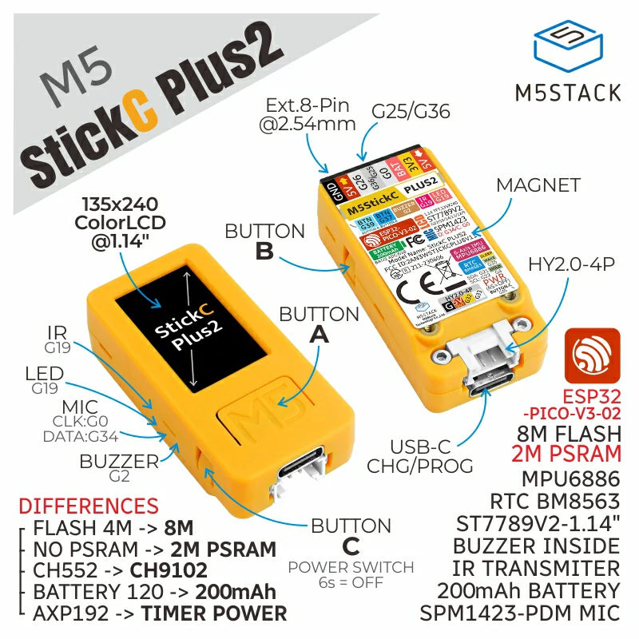
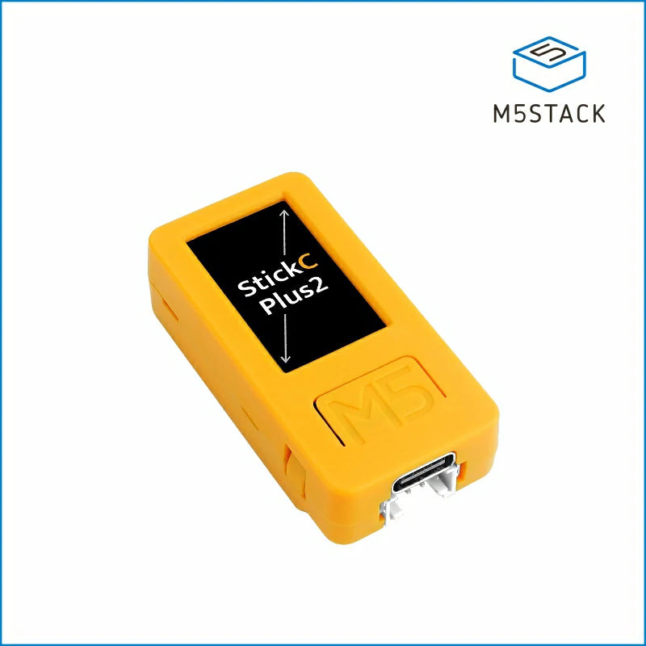

# ZTEERSTICK v0.1-RC3

A high-performance Zwift steering device using the M5StickCPlus2 with advanced IMU/AHRS implementation, intelligent power management, and seamless BLE connectivity.

## 🎯 About

This project transforms your M5StickCPlus2 into a professional-grade steering controller for Zwift cycling simulation called the **ZTEERSTICK**. Based on the excellent work from [@stefaandesmet2003/ESP32Sterzo](https://github.com/stefaandesmet2003/ESP32Sterzo.git), this implementation adds significant enhancements including:

- **Mahony AHRS algorithm** with configurable hardware filtering for ultra-stable yaw calculation
- **Intelligent power management** with position-based wake/sleep system
- **Motion-based activity detection** with 30-second timeout and automatic brightness control
- **Comprehensive calibration system** with gyro bias compensation
- **1-degree steering precision** with drift compensation and automatic centering
- **Professional button handling** with zero-yaw functionality
- **Smooth 10Hz display updates** with selective region rendering (no flashing)
- **Configurable system architecture** with hardware LPF and timing optimization

## 🛒 Hardware - M5StickC PLUS2





The M5StickC PLUS2 is a compact ESP32-based development board perfect for the ZTEERSTICK project. It features:

- **ESP32-PICO-V3-02** - Dual-core processor with built-in WiFi/BLE
- **MPU6886** - 6-axis IMU (gyroscope + accelerometer) with configurable hardware filtering
- **135x240 Color LCD** - 1.14" ST7789V2 display with adaptive brightness
- **200mAh Battery** - Built-in LiPo with charging circuit and voltage monitoring
- **Compact Design** - 25.4mm x 54mm form factor
- **Multiple Buttons** - A, B, and C (power) buttons with short/long press detection
- **USB-C** - For programming and charging

### 🛍️ Where to Buy

**[M5StickC PLUS2 on AliExpress](https://s.click.aliexpress.com/e/_okImkbs)** *(Affiliate Link)*

*Note: This is an affiliate link. Purchasing through this link supports the project development at no additional cost to you.*

## 🚀 Features

### Core Functionality
- ✅ **Zwift BLE Integration** - Full compatibility with Zwift steering protocol including handshake authentication
- ✅ **Mahony AHRS Filter** - Superior stability with configurable 10Hz hardware low-pass filtering
- ✅ **1° Steering Precision** - Fine-grained control with intelligent drift compensation
- ✅ **Position-Based Sleep System** - Uses gravity vector comparison for reliable motion detection
- ✅ **Zero-Yaw Functionality** - Button press to instantly center steering
- ✅ **Activity Detection** - Detects steering changes regardless of BLE connection status

### Advanced Power Management
- ⚡ **Position-Based Wake/Sleep** - 6-second timer wake-ups with 1-degree position threshold
- ⚡ **GPIO4 Power Hold** - Proper deep sleep power management for M5StickCPlus2
- ⚡ **RTC Memory Persistence** - Maintains wake counts and gravity baseline across sleep cycles
- ⚡ **Adaptive Brightness** - 5% active → 1% idle → 1% sleep countdown
- ⚡ **30-Second Activity Timeout** - Intelligent activity detection with visual feedback

### User Interface & Display
- 📱 **Smooth 10Hz Updates** - Flicker-free display with selective region rendering
- 📱 **Real-time Display** - Yaw angle, steering bin, BLE status, battery voltage
- 📱 **Visual Activity States** - Green dot (active), yellow dot (idle), countdown (sleep)
- 📱 **Visual Limit Indicators** - Flashing arrows at ±40° steering limits
- 📱 **Battery Monitoring** - Real-time voltage display with precision monitoring
- 📱 **Status Messages** - Clear feedback for calibration and zero operations

### Button Controls
- 🔘 **Button A Short** - Zero yaw to current position
- 🔘 **Button A Long (2s)** - Full gyro calibration sequence
- 🔘 **Button B Short** - Zero yaw to current position
- 🔘 **Button B Long (3s)** - Full gyro calibration sequence
- 🔘 **Button C** - Power/wake functionality

### Technical Improvements
- 🔧 **Configurable Architecture** - System-wide frequency configuration (10Hz IMU/Display/Motion)
- 🔧 **Hardware LPF** - MPU6886 10Hz low-pass filter with register mapping
- 🔧 **Timing Synchronization** - Eliminates race conditions in activity detection
- 🔧 **Selective Display Updates** - Only redraws changed elements, eliminates flashing
- 🔧 **Major State Transition Detection** - Forces full redraw on brightness changes

## 🛠 Hardware Requirements

- **M5StickCPlus2** - See [Hardware section](#-hardware---m5stickc-plus2) above for details and purchase links
- **USB-C Cable** - For programming and charging
- **Mounting Solution** - Handlebar mount or secure attachment method (optional)

## 📦 Installation

### Prerequisites
- [PlatformIO](https://platformio.org/) installed
- [Git](https://git-scm.com/) for cloning

### Setup
```bash
# Clone the repository
git clone https://github.com/yourusername/ZTEERSTICK.git
cd ZTEERSTICK

# Build and upload
pio run --target upload

# Monitor serial output (optional)
pio device monitor
```

### Dependencies
All dependencies are automatically managed by PlatformIO:
- `M5Unified` - M5StickCPlus2 hardware abstraction
- `ESP32 BLE Arduino` - Bluetooth Low Energy support
- `Preferences` - Non-volatile storage for calibration data

## 🎮 Usage

### First Time Setup
1. **Power On** - ZTEERSTICK performs automatic gyro calibration on first boot
2. **Zwift Pairing** - Open Zwift → Settings → Connections → Search for "STERZO"
3. **Zero Yaw** - Press Button A or B to set current position as center

### Normal Operation
1. **Mount Device** - Attach to handlebars or hold in hand
2. **Connect to Zwift** - Device advertises as "STERZO" with full handshake protocol
3. **Steering Range** - ±40° physical rotation = full Zwift steering
4. **Auto-Centering** - Built-in drift compensation gradually returns to center
5. **Activity Detection** - Device stays awake when steering changes are detected

### Power Management States
- **Active (Green Dot)** - < 5 seconds since activity, 5% brightness
- **Idle (Yellow Dot)** - 5-30 seconds since activity, 1% brightness  
- **Sleep Countdown** - > 30 seconds, shows countdown timer, 1% brightness
- **Deep Sleep** - Enters sleep after timeout, wakes every 6 seconds to check position

## 🔧 Technical Details

### IMU Configuration
- **Sensor** - MPU6886 6-axis IMU with hardware low-pass filtering
- **Algorithm** - Mahony AHRS for quaternion-based orientation
- **Hardware LPF** - Configurable 10Hz low-pass filter on both gyro and accelerometer
- **Sampling Rate** - 10Hz for optimal power/performance balance
- **Calibration** - Gyro bias compensation with 3000-sample averaging

### Position-Based Sleep System
- **Motion Detection** - Gravity vector comparison with 1-degree threshold
- **Wake Intervals** - 6-second timer wake-ups during deep sleep
- **Activity Check Duration** - 1000ms position monitoring for reliable detection
- **RTC Memory** - Preserves baseline gravity and wake counts across sleep cycles

### BLE Protocol
- **Service UUID** - `347b0001-7635-408b-8918-8ff3949ce592`
- **Steering Data** - Float32 angle in degrees (-40° to +40°)
- **Update Rate** - On-change notification (1° resolution)
- **Zwift Handshake** - Full authentication protocol with challenge/response

### Display System
- **Update Rate** - Smooth 10Hz refresh with selective region updates
- **Brightness Control** - Automatic adjustment based on activity state
- **Flicker Elimination** - Only redraws changed elements, preserves static content
- **State Transitions** - Forces full redraw on major activity state changes

## 🔄 Calibration System

### Automatic Calibration (First Boot)
1. **Gyro Bias Compensation** - 3000 samples over 3 seconds (device stationary)
2. **Baseline Establishment** - Current gravity vector stored as reference
3. **Zero Yaw Ready** - Device ready for user to set center position

### Manual Operations
- **Zero Yaw** - Short press Button A or B to set current position as center
- **Full Calibration** - Long press Button A (2s) or Button B (3s) for gyro recalibration
- **Visual Feedback** - Status messages with clear operation confirmation

## 🐛 Troubleshooting

### Common Issues

**Device not connecting to Zwift:**
- Ensure Bluetooth is enabled on your device
- Restart Zwift and search for "STERZO" in connections
- Try power cycling the ZTEERSTICK

**Device goes to sleep despite movement:**
- Ensure you're actually changing the device's orientation (not just vibration)
- Position changes must exceed 1-degree threshold
- Check that activity detection is working (green/yellow dots)

**Steering feels unstable or drifts:**
- Perform gyro calibration (long press Button A or B)
- Ensure device is mounted securely to reduce vibration
- Use zero yaw function (short press Button A or B) to recenter

**Display flashing or not updating properly:**
- System automatically handles selective updates to prevent flashing
- Major state transitions force complete redraws
- Check serial monitor for any error messages

**Battery drains quickly:**
- Device should enter deep sleep when not in use
- Check that position-based sleep system is working
- Monitor activity states (green → yellow → countdown → sleep)

### Debug Information
Enable serial monitoring to see detailed debug output:
```bash
pio device monitor
```

Debug output includes:
- IMU readings and hardware filter status
- Position change detection with gravity vectors
- Activity state transitions and timing
- BLE connection events and steering data
- Power management and sleep/wake cycles
- Button press detection and calibration progress

## 🔋 Battery Optimization Tips

1. **Proper mounting** - Stable attachment reduces false motion detection
2. **Regular use patterns** - Device learns your usage and optimizes accordingly
3. **Position-based sleep** - Automatically sleeps when not moved for 30+ seconds
4. **Brightness adaptation** - Screen dims automatically during idle periods

## 🤝 Contributing

Contributions are welcome! Please feel free to submit issues, feature requests, or pull requests.

### Development Notes
- System uses configurable frequency constants for easy tuning
- Hardware filtering is implemented with proper register mapping
- Timing synchronization prevents race conditions
- Display system eliminates flashing through selective updates

## 🏷️ About the Name

**ZTEERSTICK** combines "Z" (for Zwift), "STEER" (steering functionality), and "STICK" (the compact M5StickC form factor), creating a memorable name that perfectly describes this Zwift steering controller.

## 📄 License

This project is licensed under the MIT License - see the [LICENSE](LICENSE) file for details.

## 🙏 Acknowledgments

- **[@stefaandesmet2003](https://github.com/stefaandesmet2003/ESP32Sterzo.git)** - Original ESP32Sterzo implementation
- **M5Stack** - M5StickCPlus2 hardware and libraries
- **Zwift** - Steering protocol documentation and support
- **Mahony** - AHRS algorithm implementation

## 📊 Project Status - v0.1 Release Candidate 3

- ✅ **Core Functionality** - Complete and stable
- ✅ **Power Management** - Position-based sleep system implemented
- ✅ **Zwift Integration** - Full protocol compatibility with handshake
- ✅ **Display System** - Smooth 10Hz updates without flashing
- ✅ **Activity Detection** - Reliable motion detection regardless of BLE status
- ✅ **Hardware Filtering** - Configurable MPU6886 low-pass filtering
- ✅ **Timing Optimization** - Race condition elimination and synchronized updates
- ✅ **User Interface** - Professional button handling and visual feedback

### v0.1 Key Improvements
- **Eliminated constant resets** - Stable operation with proper power management
- **Fixed activity detection** - Works regardless of BLE connection status
- **Eliminated display flashing** - Selective region updates for smooth experience
- **Resolved timing race conditions** - Synchronized activity detection
- **Added hardware filtering** - Configurable 10Hz LPF for improved stability
- **Implemented major state transitions** - Proper screen redraws on brightness changes

---

**Built with ❤️ for the Zwift cycling community**

### 📥 Installation
1. Download source code from [ZteerStick releases](https://github.com/Felixrising/ZteerStick/releases)
2. Open in PlatformIO
3. Build and upload to M5StickCPlus2
4. See [README.md](https://github.com/Felixrising/ZteerStick/blob/dev/README.md) for detailed setup 